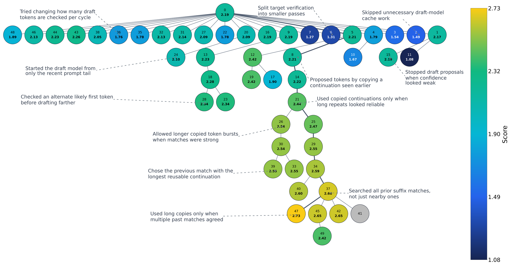

# swarmresearch
*swarmresearch* is a set of skills to reduce coding agent tunnel-vision when solving open-ended optimization problems

| Basic autoresearch | swarmresearch |
| --- | --- |
| One agent makes slow progress refining one idea  | Concurrent agents quickly screen new ideas before long-tail refinement |
| Keeping all improvements in one file biases agent towards small, greedy edits on one approach | All major edits are made in separate git branches making high-level changes easier |
| Accumulating context windows constrain exploration | Explorer subagents have fresh context windows while orchestrator steers strategic swarm behavior |

  
   
  <em>Codex GPT-5.5 with swarmresearch skills designing speculative decoding algorithms. It achieves a 3.87× speedup over vanilla decoding on Spec-Bench, a 20% improvement over the baseline. Shepherd keeps exploring diverse approaches over ~3 hours rather than converging onto one. Productive optimizations combine and vary known methods. Each node is a spawned search agent and its solution. Edges indicate that the lower node builds on the solution above. The top node value shows spawn order; the bottom value shows speedup over vanilla decoding.</em>

## When to use  
Basic autoresearch fails at exploring high-level approaches, e.g. divergent algorithms, kernel designs, anything that isn't small tweaks, by converging onto one approach too quickly. If you need an agent to autonomously explore at a higher-level, swarmresearch's design performs much better. However, if you just want tons of micro-optimizations, autoresearch is a more efficient way to accomplish that. FYI the `optimizer` skill is just a basic autoresearcher the orchestrator can spawn. 

## How to use  
The swarm's working directory requires:
- `prompt.md`: file describing the problem and how to access the evaluator. 
- `evaluator`: A way an agent can score their solution. Coding agents are excellent reward hackers. We suggest keeping evaluator code outside of the agent's working directory and explicit instructions in `prompt.md` to not look for it.
- `baseline` (optional): A minimal working baseline working on your evaluator gets the agent writing successful solutions faster

For an example, check out the [speculative decoding setup](spec_dec_example/spec-dec-swarm-eval).

The skills only work with Claude Code and Codex as of now but can be easily extended for any coding agent. See [Supporting other coding agents](README.md#supporting-other-coding-agents).

**Managing Cost:** As a reference, the 50 agent ~3 hour run for speculative decoding with Codex GPT-5.5 High used up 7% of my weekly limits on ChatGPT Pro 5x (May 26, 2026). Compared to basic autoresearch, you should should get better results in less time since the coding agent doesn't get stuck in locally optimal solutions.

## Extending and editing the skills
There are 3 skills:
- `shepherd`: The orchestrator. Spawns search agents and steers populations's search behavior. Prompts emphasize initializing and maintaining a diverse population of ideas, prioritizing effort on promising ideas, and breaking out of plateaus. It has access to 3 steering mechanisms when spawning new search agents: parent selection, search agent type, and prompts.
- `shepherd-explorer`: Explorers have fresh context windows and use the content in their worktree as context. Their goal is to explore new approaches. 
- `shepherd-optimizer`: Optimizers fork their parent agent's conversation history, in addition to using worktree content as context. Their goal is to make a few refinements to the parent solution.

We recommend reading the blog or paper for a more complete description.

### Supporting other coding agents
The shepherd skills spawns search agents by launching non-interactive Codex/CC sessions. This is necessary to support forking conversation histories for optimizers, which isn't possible with native subagents as far as I know. Spawning non-interactive agent sessions has different commands for different coding agents, so they should be specified.